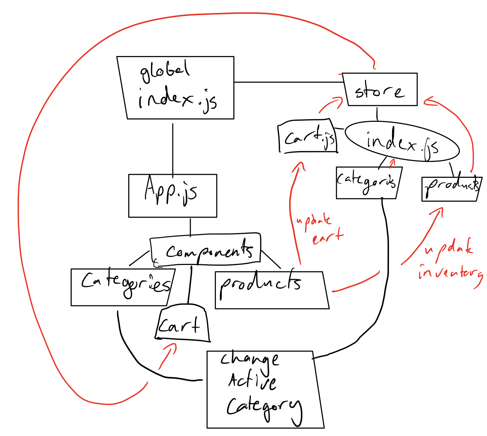

## Project: Virtual Store

### Author: Joshua Williams

### LAB - 9/29/2020 

### Links and Resources

- [GitHub Repository](https://github.com/josh-williams-401-advanced-javascript/storefront)

### Setup

```
git clone https://github.com/josh-williams-401-advanced-javascript/storefront.git
cd storefront
npm i
```

#### `.env` requirements
N/A
#### How to initialize/run your application (where applicable)
```
npm start
```
#### How to use your library (where applicable)
When you start the program, click on the different categories to see the different products associated with that category. Click add to cart by an item to see it go to the cart section. To see that the inventory is working, 'Miles Davis: Kind of Blue' has a default inventory of only 1. Add it to the cart, and it will be removed from the products. Remove it from the cart, and it will be back in the products.

#### Tests
Tests show expected initial state, and expected state after changing active category and adding to cart.
```
npm test
```

#### UML

