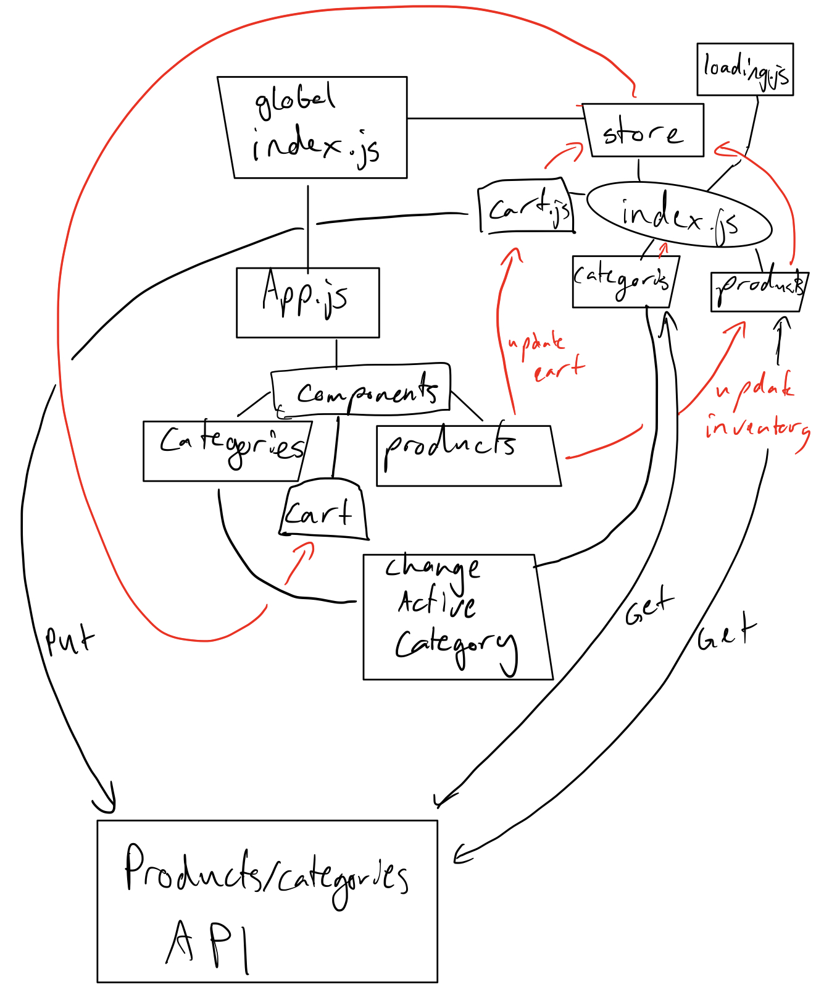

## Project: Virtual Store

### Author: Joshua Williams

### LAB - 9/30/2020 

### Links and Resources

- [GitHub Repository](https://github.com/josh-williams-401-advanced-javascript/storefront)

### Setup

```
git clone https://github.com/josh-williams-401-advanced-javascript/storefront.git
cd storefront
npm i
touch .env
```

#### `.env` requirements
```
REACT_APP_API=https://api-js401.herokuapp.com/api/v1
```
#### How to initialize/run your application (where applicable)
```
npm start
```
#### How to use your library (where applicable)
When you start the program, click on the different categories to see the different products associated with that category. Click add to cart by an item to see it go to the cart section. Add it to the cart, and the inventory count will go down. Remove it from the cart, and the inventory count will go up.

#### Tests
Tests show expected initial state, and expected state after changing active category and adding to cart. There are additional tests that show that the page renders the correct initail content.
```
npm test
```

#### UML

