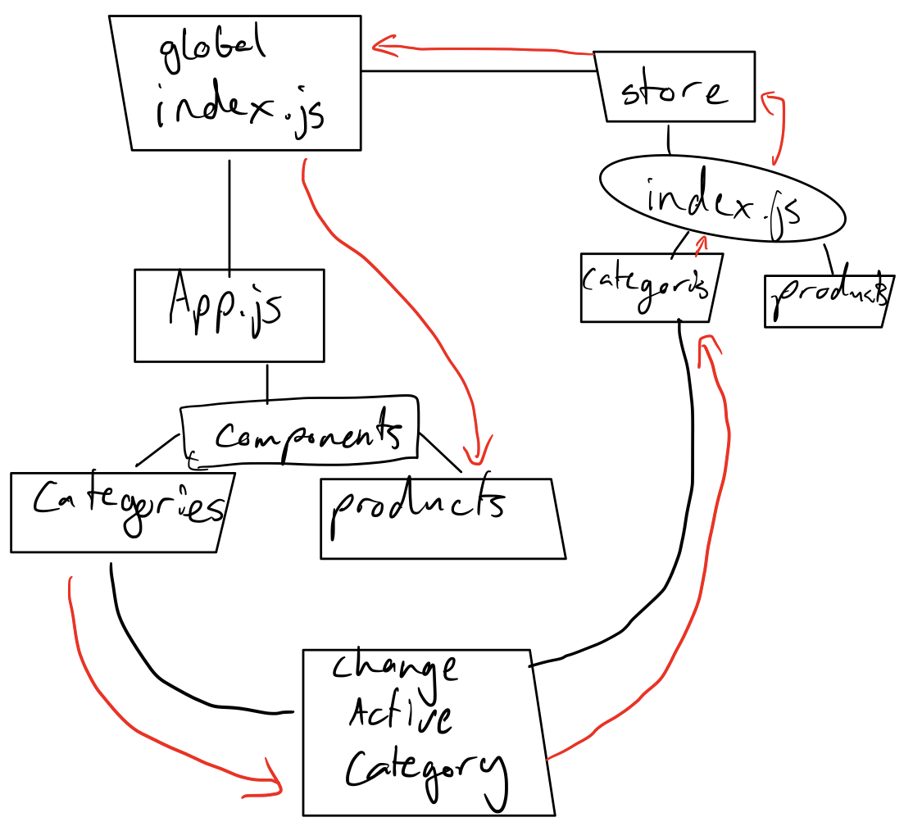

## Project: Virtual Store

### Author: Joshua Williams

### LAB - 9/28/2020 

### Links and Resources

- [GitHub Repository](https://github.com/josh-williams-401-advanced-javascript/storefront)

### Setup

```
git clone https://github.com/josh-williams-401-advanced-javascript/storefront.git
cd storefront
npm i
```

#### `.env` requirements
N/A
#### How to initialize/run your application (where applicable)
```
npm start
```
#### How to use your library (where applicable)
When you start the program, click on the different categories to see the different products associated with that category. 

#### Tests

No tests yet

#### UML

